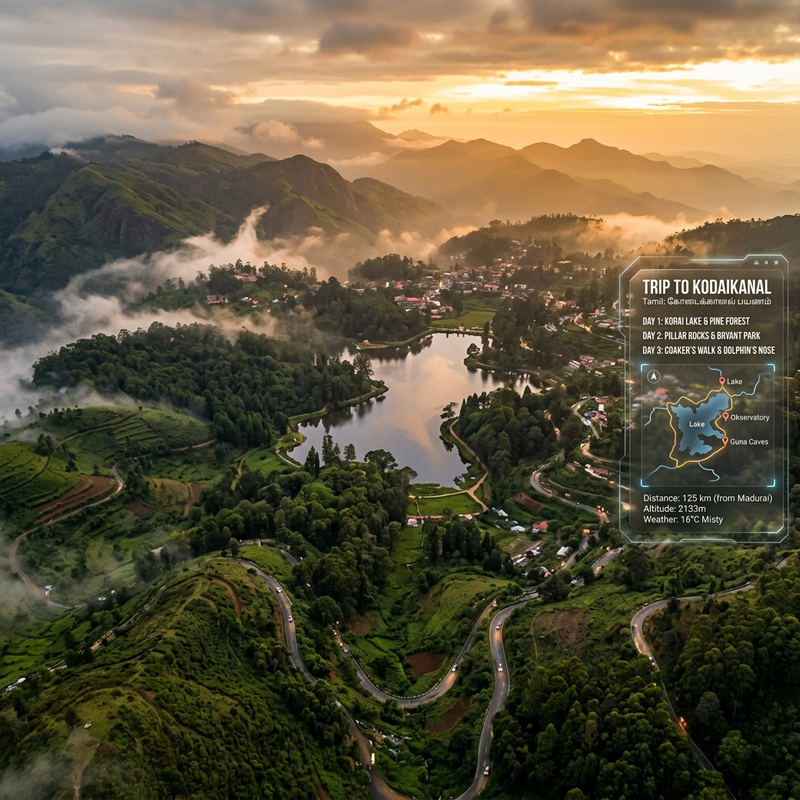
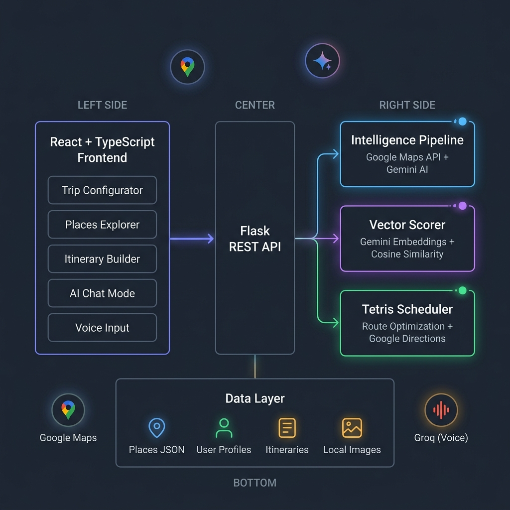

<p align="center">
  
</p>

<h1 align="center">🏔️ Kodaikanal Travel Agent</h1>

<p align="center">
  <strong>An AI-powered trip planner that thinks like a local guide and plans like a logistics engine.</strong>
</p>

<p align="center">
  <em>Tell it your vibe. It builds your perfect Kodaikanal itinerary — scored, scheduled, and route-optimized.</em>
</p>

<p align="center">
  
  
  
  
  
  
</p>

<br/>

---

## 🎯 The Problem

Planning a trip to Kodaikanal sounds simple — until you realize:
- There are **50+ places** to visit, but which ones actually match *your* interests?
- The Forest Circuit is a **one-way road** — visit places in the wrong order and you'll backtrack for hours.
- You need to balance **difficulty levels** (some spots require serious trekking), **opening hours**, **drive times**, and **lunch breaks**.
- Most travel blogs give you a generic list. None of them build a **timed, route-optimized, day-wise itinerary** personalized to your pace and group.

**This app does.**

---

## ✨ What It Does

The Kodaikanal Travel Agent is a full-stack intelligent trip planner that combines **real-time data from Google Maps**, **AI-powered scoring via Gemini embeddings**, and a **custom scheduling engine** to produce personalized, route-optimized itineraries.

### Two Ways to Plan

| 🎛️ **Manual Mode** | 🤖 **AI Chat Mode** |
|---|---|
| Step-by-step configurator UI | Conversational interface with "Koda" |
| Set dates, group, pace, interests | Just chat naturally about your trip |
| Visual place explorer with scores | AI recommends places based on your vibe |
| Drag-and-drop itinerary builder | Auto-generates and saves your itinerary |
| Full control over every parameter | Voice input/output via Groq Whisper + Orpheus |

### Key Features

- 🧠 **Smart Place Scoring** — Every place is ranked using a weighted blend of **cosine similarity** (your interests vs. place embeddings) and **popularity** (review-based). You control the weight slider.
- 🗺️ **Route-Optimized Scheduling** — The "Tetris Engine" packs places into days respecting drive times (Google Directions API), opening hours, difficulty anchoring, and lunch breaks.
- 🌲 **Forest Circuit Intelligence** — Auto-detects the one-way forest road and ensures places are visited in the correct sequence, summing travel times across skipped stops.
- 📍 **Cluster-Based Day Planning** — Kodaikanal is divided into 4 clusters (Town Center, Forest Circuit, Vattakanal, Poombarai). Days are organized by cluster to minimize cross-town driving.
- 🍽️ **On-Route Eatery Finder** — Finds restaurants along the driving route between two stops using Google Maps Nearby Search. For forest areas, uses Gemini with Google Search grounding.
- 🎤 **Voice Interface** — Speak your preferences. Groq Whisper transcribes, Gemini plans, Orpheus TTS reads back the itinerary.
- 🔗 **Shareable Permalinks** — Save and share your itinerary via a unique URL. Anyone can view the full day-wise plan.
- 🗺️ **Embedded Google Map View** — Each day's route is displayed on an interactive embedded Google Map with markers and driving directions.

---

## 🏗️ Architecture

<p align="center">
  
</p>

The system is composed of **three core engines** behind a Flask REST API, consumed by a React + TypeScript frontend:

### 1. Intelligence Pipeline (`fetch_place_data.py`)
A 3-stage data aggregation pipeline:
| Stage | Source | Data |
|-------|--------|------|
| **Stage 1: Hard Data** | Google Maps Places API | Name, coordinates, rating, reviews, photos, opening hours |
| **Stage 2: Soft Data** | Gemini 2.0 Flash (with Google Search grounding) | Tags, difficulty, tips, avg visit time, best time, summary |
| **Stage 3: Clustering** | Google Distance Matrix API | Cluster zone assignment (Town Center / Forest Circuit / Vattakanal / Poombarai / Outskirts) |

Images are **downloaded and stored locally** to prevent URL expiration — a production lesson learned the hard way.

### 2. Vector Scorer (`scorer.py`)
A transparent, lightweight ranking engine:
```
Final Score = (Similarity × sim_weight) + (Popularity × pop_weight)
```
- **Similarity (0–100)**: Cosine similarity between the user's interest vector and pre-computed Gemini embeddings for each place
- **Popularity (0–100)**: Derived from Google review counts using a rank-based formula
- **Soft-Gate Flags**: Difficulty warnings and outskirts flags instead of hard filters — the user always sees all places

No heavy ML models. No PyTorch. Just **one Gemini API call** per scoring request (to embed the user query). Place embeddings are pre-computed offline via `scripts/sync_embeddings.py`.

### 3. Tetris Scheduler (`scheduler.py`)
The day-wise itinerary builder:
- **Forest Circuit**: Strictly follows the one-way route order. Rebuilds automatically via Google Maps Directions when new places are added.
- **Standard Clusters**: Uses **Hardest-First anchoring** — the toughest place is visited first (morning energy), then Google Maps optimizes the remaining waypoint order.
- **Pace Limits**: Slow = 3, Medium = 5, Fast = 8 places/day
- **Cluster Merging**: When days < clusters, merges the two smallest clusters for balanced days.
- **Day Splitting**: When days > clusters, splits the longest day (never splits Forest Circuit).
- **Time Scheduling**: Calculates start/end times per-place, inserts 90-minute lunch breaks, and flags overflow.

### 4. AI Chat Engine (`services/trip_llm_engine.py`)
Conversational trip planning powered by **Gemini 3 Flash** with function calling:
- 5 tool functions: `save_trip_context`, `fetch_ranked_places`, `select_places`, `build_itinerary`, `save_itinerary`
- Progressive UI widgets (date picker → pace selector → place carousel → itinerary view)
- Context-injected system prompts to avoid re-asking already-collected info
- Local follow-up generation for fast context-save responses

---

## 🖥️ Frontend

Built with **React 18 + TypeScript + Vite**, styled with **Tailwind CSS** and **Framer Motion**:

| Page | Description |
|------|-------------|
| **Trip Configurator** | 3-step wizard: Logistics → Journey & Stay → Vibe & Interests. Hollywood-style terminal boot animation. |
| **Places Explorer** | All 50+ places displayed as scored cards with popularity/similarity breakdown. Weight slider for real-time re-ranking. |
| **Itinerary Builder** | Day-wise timeline with scheduled times, drive durations, lunch breaks, map view, and eatery suggestions. |
| **AI Chat Mode** | Full conversational interface with "Koda" — includes place carousel widget, itinerary view, and voice I/O. |
| **Places Database** | Admin view of all place data with search, filter, and detail modals. |
| **Shared Itinerary View** | Public permalink page for sharing itineraries with friends. |

---

## 🚀 Getting Started

### Prerequisites

- **Python 3.10+**
- **Node.js 18+** and **npm**
- **API Keys** for:
  - [Google Maps Platform](https://console.cloud.google.com/apis) (Places, Distance Matrix, Directions, Embed)
  - [Google AI Studio](https://aistudio.google.com/app/apikey) (Gemini API)
  - [Groq Console](https://console.groq.com/keys) (optional, for voice features)

### 1. Clone the Repository

```bash
git clone https://github.com/Atman-Deshmane/Travel-Agent.git
cd Travel-Agent
```

### 2. Backend Setup

```bash
# Create and activate virtual environment
python -m venv .venv
source .venv/bin/activate   # macOS/Linux
# .venv\Scripts\activate    # Windows

# Install dependencies
pip install -r requirements.txt
```

### 3. Configure Environment

Create a `.env` file in the project root:

```env
# Google Maps API Key (Places, Distance Matrix, Directions, Embed)
GOOGLE_MAPS_API_KEY=your_google_maps_key

# Gemini API Key (Gemini 2.0 Flash + Embeddings)
GEMINI_API_KEY=your_gemini_key
GEMINI_API_KEY_CAPSTONE_1=your_gemini_key

# Groq API Key (optional — for voice STT/TTS)
GROQ_API_KEY=your_groq_key
```

### 4. Frontend Setup

```bash
cd trip-dashboard
npm install
```

### 5. Run Locally

```bash
# Terminal 1 — Backend (from project root)
python server.py

# Terminal 2 — Frontend (from trip-dashboard/)
cd trip-dashboard
npm run dev
```

The app will be available at:
- **Frontend**: `http://localhost:5173`
- **Backend API**: `http://localhost:5001`

---

## 🐳 Production Deployment

The app is Docker-ready with Nginx reverse proxy support:

```bash
# Build and run with Docker Compose
docker compose -f docker-compose.prod.yml up -d --build

# Or use the production-safe deployment script
chmod +x deploy.sh
./deploy.sh
```

The deploy script checks Docker, system resources, port availability, and sets up Nginx — all without disturbing existing services on the server.

**Live at**: [100cr.cloud](https://100cr.cloud)

---

## 📂 Project Structure

```
Travel-Agent/
├── server.py                    # Flask REST API (1200+ lines, 20+ endpoints)
├── fetch_place_data.py          # 3-stage Intelligence Pipeline
├── scorer.py                    # Vector Scorer (Gemini embeddings + cosine similarity)
├── scheduler.py                 # Tetris Scheduler (route optimization engine)
├── discover_places.py           # Place discovery via Google Maps search
├── optimize_clusters.py         # Cluster optimization utilities
├── build_core_route.py          # Core route (golden loop) builder
│
├── services/
│   ├── trip_llm_engine.py       # Gemini AI chat engine with function calling
│   └── groq_voice.py            # Whisper STT + Orpheus TTS via Groq
│
├── trip-dashboard/              # React + TypeScript frontend (Vite)
│   └── src/
│       ├── pages/               # PlacesExplorer, ItineraryBuilder, ChatMode, etc.
│       ├── components/          # TripConfigurator, PlaceCard, Sidebar, Widgets
│       ├── store/               # Zustand state management
│       └── config/              # API configuration
│
├── data/                        # Places JSON, embeddings, route caches, local images
├── user_data/                   # Persisted user profiles and saved itineraries
├── scripts/                     # Utility scripts (sync embeddings, setup, update)
│
├── Dockerfile                   # Production container (Python 3.10 + Gunicorn)
├── docker-compose.prod.yml      # Production orchestration
├── deploy.sh                    # Production-safe deployment script
├── travel-agent.nginx           # Nginx reverse proxy config
└── requirements.txt             # Python dependencies
```

---

## 🔌 API Endpoints

| Method | Endpoint | Description |
|--------|----------|-------------|
| `GET` | `/api/places` | Get all places from the master database |
| `GET` | `/api/places/top/:n` | Get top N places by popularity |
| `GET` | `/api/places/autocomplete?q=` | Hybrid autocomplete (local DB + Google Maps) |
| `POST` | `/api/fetch` | Run the full Intelligence Pipeline for a new place |
| `POST` | `/api/fetch-scored-places` | Score all places with user profile and weights |
| `POST` | `/api/build-itinerary` | Build day-wise itinerary from selected places |
| `POST` | `/api/save-itinerary` | Persist itinerary to user's folder |
| `GET` | `/api/load-itinerary/:user/:trip` | Load a saved itinerary |
| `POST` | `/api/nearby-eateries` | Find restaurants along the route between two stops |
| `POST` | `/api/route-map-url` | Generate Google Maps Embed URL for a day's route |
| `POST` | `/api/chat` | Send message to AI chat engine (Koda) |
| `POST` | `/api/voice/stt` | Speech-to-text via Groq Whisper |
| `POST` | `/api/voice/tts` | Text-to-speech via Groq Orpheus |
| `GET` | `/api/warmup` | Pre-initialize the scorer model |

---

## 🛠️ Tech Stack

| Layer | Technology | Purpose |
|-------|-----------|---------|
| **Frontend** | React 18, TypeScript, Vite | SPA with rich interactive UI |
| **Styling** | Tailwind CSS, Framer Motion | Responsive design with micro-animations |
| **State** | Zustand | Lightweight global state management |
| **Backend** | Flask, Flask-CORS | REST API server |
| **AI / LLM** | Gemini 2.0 Flash, Gemini 3 Flash | Data enrichment, chat, function calling |
| **Embeddings** | Gemini Embedding-001 | Semantic place scoring |
| **Maps** | Google Maps Platform | Places, Directions, Distance Matrix, Embed |
| **Voice** | Groq (Whisper + Orpheus) | Speech-to-text and text-to-speech |
| **Math** | NumPy, SciPy | Cosine similarity, vector operations |
| **Production** | Docker, Gunicorn, Nginx | Containerized deployment |

---

## 🧪 How the Scoring Works

```
User says: "I love trekking, waterfalls, and peaceful nature spots"
                    ↓
         Gemini embeds this into a 768-dim vector
                    ↓
    Cosine similarity against each place's pre-computed embedding
                    ↓
         Dolphin's Nose:  Sim=87.3  Pop=100.0  → Final: 92.2
         Pine Forest:     Sim=82.1  Pop=98.0   → Final: 88.5
         Kodai Lake:      Sim=61.4  Pop=100.0  → Final: 77.0
         Wax Museum:      Sim=23.8  Pop=72.0   → Final: 43.1
                    ↓
    Places ranked, user selects favorites, Tetris builds the schedule
```

---

## 💡 Design Decisions Worth Noting

1. **No heavy ML models** — The scorer uses Gemini's embedding API (one call per request) instead of running sentence-transformers or PyTorch locally. This keeps the Docker image lean (~200MB vs 2GB+).

2. **Soft-gate instead of hard filters** — Places that exceed the user's difficulty level are flagged, not removed. This respects user autonomy while surfacing relevant warnings.

3. **Pre-computed embeddings (ETL pattern)** — Place embeddings are generated offline and cached to `data/place_embeddings.json`. Runtime only embeds the user query. This cuts latency from ~5s to ~300ms.

4. **Local image storage** — Google Places photo URLs expire. We learned this in production when all images broke overnight. Now images are downloaded and stored locally during the pipeline.

5. **Forest Circuit one-way intelligence** — The forest road is physically one-way. The scheduler maintains a cached optimal route order and sums travel times across skipped stops when only a subset of forest places are selected.

---

## 📖 Capstone Project

This project was built as a **NextLeap Capstone Project**, demonstrating:
- End-to-end full-stack development (React + Flask + AI)
- Real-world API integration (Google Maps Platform, Gemini AI, Groq)
- Production deployment (Docker, Nginx, VPS)
- Problem-solving with algorithmic thinking (route optimization, vector scoring, scheduling)
- Conversational AI with function calling and progressive UI

---

## 👤 Author

**Atman Deshmane**

- GitHub: [@Atman-Deshmane](https://github.com/Atman-Deshmane)

---

## 📄 License

This project is for educational and demonstration purposes as part of the NextLeap Capstone program.

---

<p align="center">
  <em>Built with obsessive attention to detail, late-night debugging sessions, and a genuine love for Kodaikanal.</em>
</p>

<p align="center">
  <strong>⭐ If this project impressed you, consider starring the repo!</strong>
</p>
